# Glamapaws

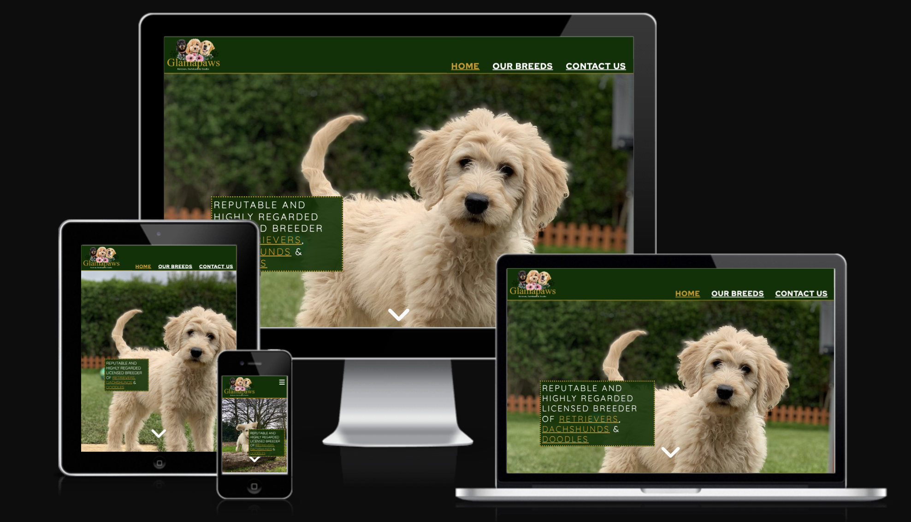

Visit the deployed site: [Glamapaws](https://cameronjamesw.github.io/glamapaws/index.html)

Welcome to Glamapaws, a dog-breeding website designed to attract more clients for the dog breeder at hand, Jodie Thomas of Glamapaws.

With over 30% of households owning a dog within the United Kingdon, the utilisation of trust-worthy dog breeders continues to grow. However with so many breeders using third-party websites to host their advertisements, it is becoming harder for clients to narrow down reliable and trusted breeders.

With Glamapaws, Jodie now has her own personal website that eliminates the need to use a third-party website, and in turn the business goal hopes to see a growth in clients through transparency and commitment to her business.

## Features

### Existing Features

In this section the current features of the Glamapaws website shall be outlined.

- **Header**

  - The header can be found fixed at the top of all the Glamapaws pages. There are links to Home, Our Breeds and Contact Us allowing for flexible and easy navigation.
  - The Glamapaws logo is also featured within the header and this is allows for another method of navigating to the home page.

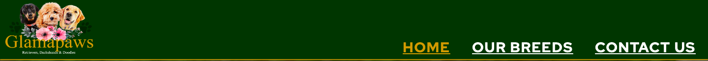

- **Hero**

  - The hero image can be found directly underneath the header. It features a large image of a Golden Doodle, one of the 3 dog breeds that Jodie breeds. Throughout the website, the sructure of a hero image is maintained however the image changes to reflect the content.
  - Within the hero image can be foun the hero text outlinig to the user that Glamapaws are a reputable and highly regarded breeding service.
  - A down-arrow can be found towards the bottom of the hero image encounaging the user to scroll down. Upon clicking the down-arrow, the user is taken to the next section - about me.

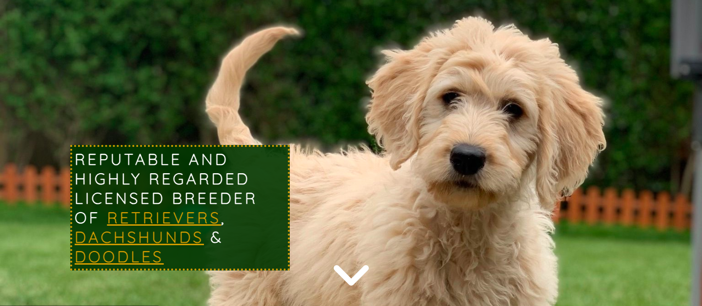

- **About Me**

  - The about me section is split into 3 different divs consisting of About Me, Certifications and a photo of Jodie with one of her Golden Retrievers.
  - The About Me text was provided by Jodie herself and this gives the user an insight into who Jodie is and the background she has come from with the view of transparency. Important text has been colored with `#CC9900` to draw attention to it.
  - Certifications allows the user to see that Jodie has an official breeding status which is reinforced through the council and trading standards agenciess.
  - A photo of Jodie included with one of her own breeds in order for the user to put a name to a face.

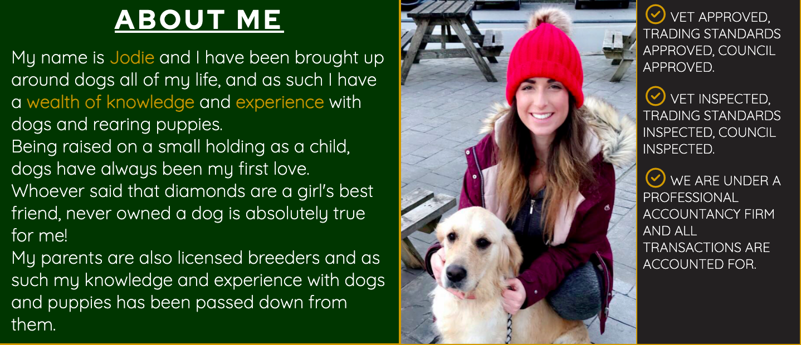

- **About Glamapaws**

  - The About Glamapaws contains information about the breeding service that Jodie runs and this also offers futher information to the user on what to expect when purchasing from Glamapaws.
  - Again, important information is coloured `#CC9900` in order to draw attention to it. The 'Fit to Breed' text is linked to the official kennel club page where the user can find out more on what 'Fit to Breed' means.

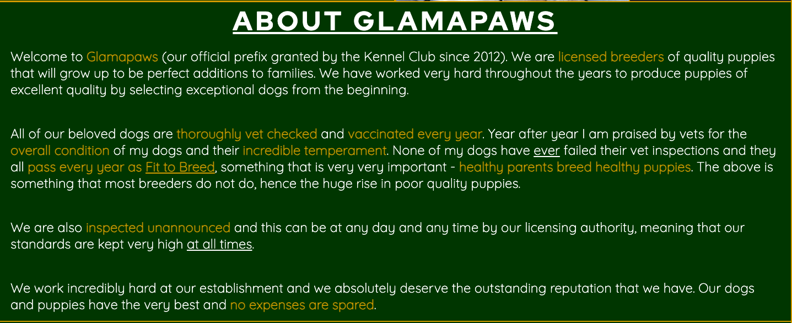

- **About Our Pups**

  - The About Our Pups section of the website contains more information regarding the puppies that Jodie breeds. This gives the user further information about the condition and rearing of the puppies from birth.
  - Further down, a 'puppy list' is provided which gives the user a clear and transparent expectation of what they can expect when collecting their new puppy for the first time. The list provided is designed to ease stresses surrounded what can be an anxious experience for a lot of people.

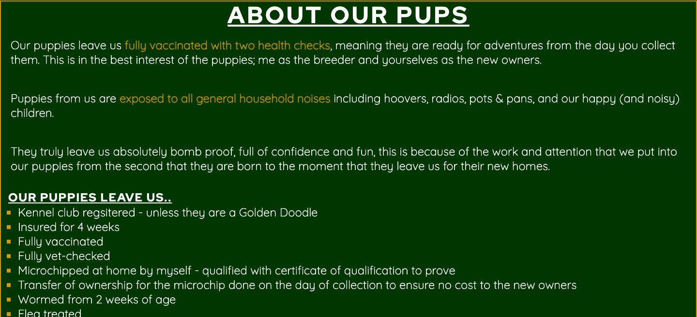

- **Map**

  - A map has benn included just about the footer of the page in order for the user to see where Glamapaws are based in relation to their location.
  - For privacy purposes the map location is the local area of where Jodie is based, not an exact address.

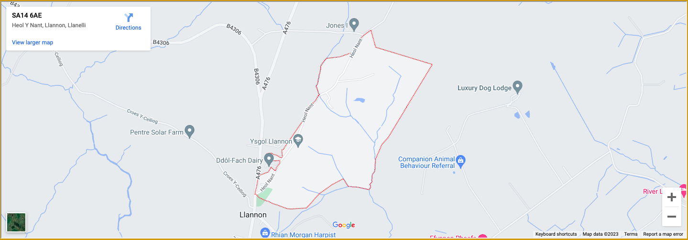

- **Footer**

  - The footer is located at the very bottom of each page. It includes links to all the ways users can contact Glamapaws, these include through Instagram, through email and through phone.
  - The footer provides a direct link to Jodie for the user - in particular the mobile phone icon which allows the user to call Glamapaws within moments of clicking the button.

- **Breed Header**

  - When navigating within the Breeds pages of the website, the user will notice the header's height has been increased to encorporate the 3 breeds for flexible navigation.
  - This allows the user to easily navigate across the 3 breeds without having to back-track to any previous pages.

- **Breeds Information**

  - Within the 3 breeds pages, the user can find information about the breed inqquestion. This is split into 4 different sub-categories of Personality, Health, Exercise and Maintenence.
  - The aim of this is to answer FAQs that the user may have when viewing, and also give the user an idea of what to expect if purchasing one of the dogs.
  - The sub-categories are structured with flex-box in order to give a compact yet neat look when viewing on different devices.

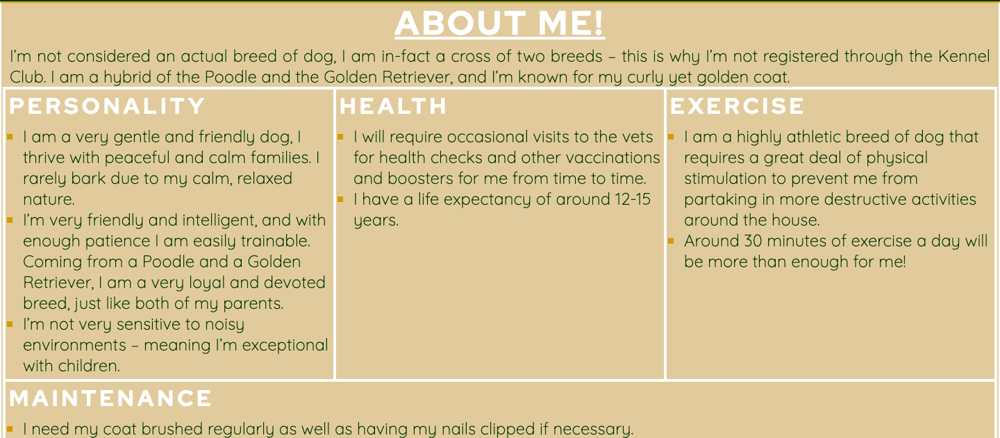

- **Contact Us**

  - The contact us page features a hero image of a woman holding a Miniature Dachshund to provoke an emotive response for the user.
  - A contact form is located on the page where the user can contact Glamapaws along with showing interest in a particular breed through a radio button. Users will be required to enter their first and last name along with their phone number. Entering the email address is optional.
  - Upon submitting the form the user's details will be passed onto Glamapaws where they can expect them to be in touch.

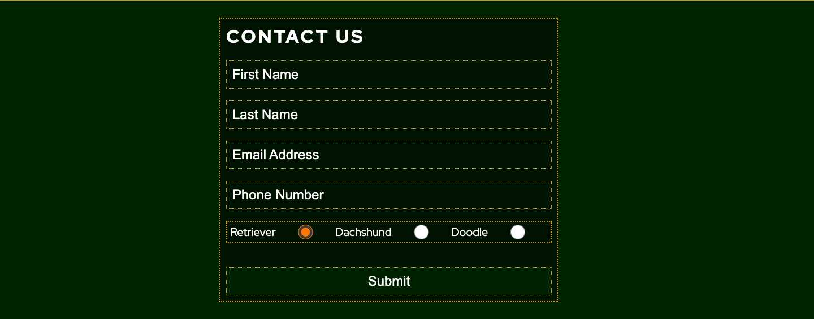

- **Aesthetic**

    - The main colors used throughout the website are as follows:
      - `#CC9900` - a lovely royal gold
      - `#003200` - a rich royal green used for the background colors
      - `#ffffff` - a solid white provides and excellent contrast amongst the royal green background
      - `#dfcaa0` - a smooth cream color used for the background of the breeds information pages

- Initially the color pallet was very different to the one here, it started off with pastal pink and blue; however after much consideration with Jodie, we both thought it was best to change to the pallet above. The colors here offer a very royal aesthetic as well as offering an excellent contrast for accessiblity - furthermore the royalty colors involved suit the brand name of 'Glamapaws'.

- **Font Style**

- Both font styles used were taken from Google Fonts
  - The first is Red Hat Display - which was used for headings and other large font-styles. The weight of the font was easy to read and it natrually brought a lot of attention to itself.
  - The second font style is Quicksand - and this was used for paragraph, lists and other standard sized text elements. The font was very soft and smooth, easy to read. With this font style being a sans-serif it is easily compatitlbe with a majority of browsers.

### Future Features

- **Reviews**

  - After speaking with Jodie since the final deployment of the website, I am looking to implement a reviews section either within the home page, or seperately within a 'reviews' page. A review section would pose further transparency to future users through sharing past clients' experiences.

- **Breeds Expansion**
 - Further detail within each of the breeds pages is neccessary. The information is very basic right now, so links to extennal sources such a official breed pages and YouTube videos would be beneficial to the user.

# Testing 

## Fixed Bugs

  - Testing the Glamapaws website has been an interesting process as the majority of bugs and issues have arrisen when testing the website on iOS devices.

### Enlarged Image

When viewing the dach.html and doodle.html pages on iOS devices, the hero images of the pages in question appeared enlarged, thus contrasting the preview. (see below)
  
- __iOS View__
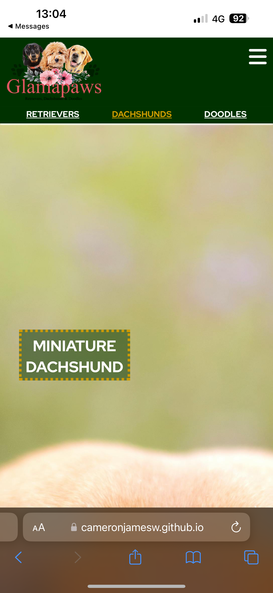
  - The image above portrays the view of the dach.html on an iOS iPhone 14 Pro Max, notice how the image is unrecognisable due to how stretched it is. The image was viewed within Safari, Firefox and Google Chrome with cleared cache.

- __DevTools Preview__
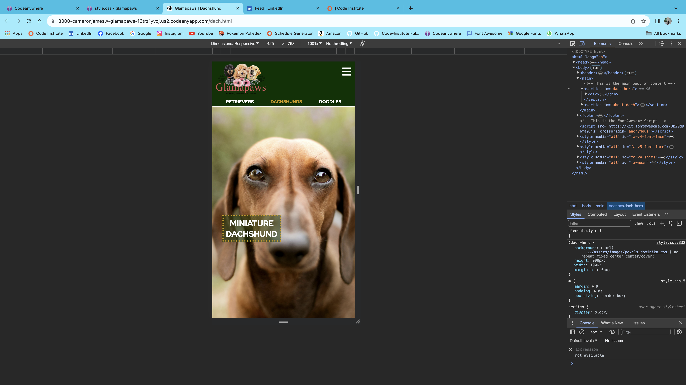
  - This is the same deployed page with the same screen width through the view of Google Chrome DevTools, notice how the apsect ratio of the image perfectly fits the page size.

- __Android Devices__
  
  - It was interesting to note that when the live sight was viewed on Android devices (Samsung A14 and Google Pixel 7a) the bug was not a problem, thus confirming that it was a bug with iOS.

- __Resolution__

  - After a few days of troubleshooting through Slack and Google, I contacted a tutor who helped me work around the issue. The issue lay in the attribute of the background image, the background image had an attribute of 'fixed' as I wanted the text to scroll up from the bottom, on top of the image. We reached the conclusion that this was causing the issue as changing the attribute to 'fixed' resolved how the image appeared.

## Unfixed Bugs

### Stretched Radio Buttons 

When viewing the Contact Us page on an iOS device with a screen width smaller than 768px the Radio input stretches greater than the screen width. Flex-box has been used in order to wrap the radio buttons, so it is assumed that this is potentially causing the issue.

When viewing the live sight on an Andrid device (Samsumng A14) there is no issue with the display of the radio buttons.

### Down-Arrow Bug

The down-arrow that is found on the index.html page has a slight bug that I want to draw attention to. When clicking the button the user is taken to the About Me section of the website however the view height lands just below the About Me heading, something I am not happy with. The reason for this is because the header has the 'fixed' attribute, taking it out of the semantic flow of elements, therefore the browser does not register to position the anchor just below the bottom of the header.

I'm sure there is a way of fixing this, or altering the anchor point however I was short of time by the end of the project and I didn't see this as a big enough issue to rectify prior to submission.

### Validator Testing 

 Glamapaws has been tested with the official [W3C Validator](https://validator.w3.org/) and no errors were returned.
  
 Glamapaws has been tested with the official [Jigsaw Validator](https://jigsaw.w3.org/css-validator/) and no errors were returned.

# Deployment

The sight was deployed to GitHub pages. The steps to deploy are as follows:
  - In the GitHub repository navigate to the Settings tab
  - From the source section drop-down menu, select the Master branch
  - Once the master branch has been selected the page will be automatically refreshed with a detailed ribbon display to incidate a successful deployment

The live link can be found here - [https://cameronjamesw.github.io/glamapaws/](https://cameronjamesw.github.io/glamapaws/)

# Credits

## Content

- The text for the home page was taken from Jodie Thomas of Glamapaws

- The code for the drop-down menu for smaller devices was taken from Code Institute's Love Running Project, located [here](https://learn.codeinstitute.net/courses/course-v1:CodeInstitute+LRFX101+2023_Q2/courseware/e805068059af42af87681032aa64053f/7525117e5cd144daa2a7b0c57843bbee/)

- The icons within the footer, the burger icon and the ticks for certifications were taken from [Font Awesome](https://fontawesome.com/)

- The dog breeds information featured were adaptations of information taken from the [Smart Dog Lover](https://www.youtube.com/@smartdoglover4295) Youtube channel.

- The font styles 'Red Hat Display' and 'Quicksand' were both taken from [Google Fonts](https://fonts.google.com/)

## Media

- The Favicon was taken from [clker.com](https://www.clker.com/clipart-gold-paw-print-4.html)

- The paw prints background was taken from [pxfuel.com](https://e0.pxfuel.com/wallpapers/492/717/desktop-wallpaper-iphone-and-android-pink-paw-print-pink-dog.jpg)

- The home page images and the Glamapaws logo were provided by Jodie Thomas and were taken herself, property of Glamapaws

- All other images featured throughout the webpage were taken from [pexels](https://www.pexels.com/)

## Honourable Metions

- I would like to say thanks to my mentor Jubril Akolade for helping me throughout the project and giving extremely valuable advise at all times.
  
- Although I did not take any code or ideas, I refered to [Web Dev Simplified](https://www.youtube.com/@WebDevSimplified) more often than not when I was struggling to understand concepts and I needed some visual aid.

- Special thanks to my good friend Tristan Orton for altering the Glamapaws logo text from a pastal pink to `#CC9900` in order to fit the website's aesthetic.